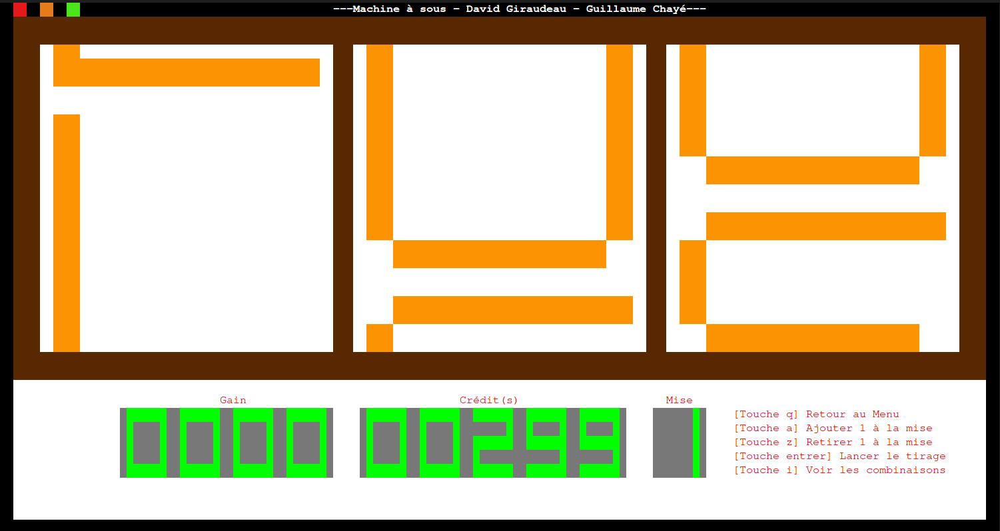

# SLOT MACHINE

A slot machine with a termianl user interface



## Build

- System requirements: gcc, make
- Build and/or run the project: ``make``

## Themes

You can add your own themes without recompiling the program. The program loads dynamically themes so you can easily create a theme.

Follow theses steps to create a theme:

- create a new folder in ``themes`` folder and name it with your theme's name.
- create two files: ``combinations.txt`` and ``characters.txt``
- inside ``characters.txt`` specify the characters you are using and the file associated (the file which contains the representation of your characters  ->10x10)
  example of `combinations.txt`:

  ```
  1.txt 1
  3.txt 3
  4.txt 4
  6.txt 6
  7.txt 7
  8.txt 8
  ```

    example of`8.txt`:

  ```
  88888888
  8        8
  8        8
  8        8
  88888888
  8        8
  8        8
  8        8
  8        8
   88888888
  ```

Please note that it is important to draw the characters with the characters it refers to.

- Inside `combinations.txt` simply add the winning combinations and the reward associated (max 1000). A reward of 1000 will trigger the jackpot animation (see builtin jackpot theme).
  example of `combinations.txt`:

  ```
  BON 1000
  LOL 500
  SOS 200
  SSS 200
  BBB 200
  EEE 200
  LLL 200
  NNN 200
  ```

That's it. If you follow these steps it should work properly.

Bonus: you can add if you want an image for your theme. Just add a bitmap image (.bmp) whose dimensions are: 43x26 pixels

## Logs

The program provides logs to helps you debugging your themes or to track missing assets. The file path is: `data/machine.log`

